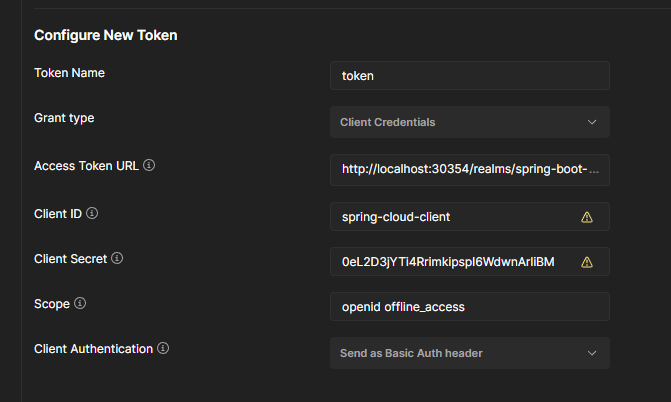

# Microservices E-Commerce Platform

## Author
Vishal Narayan

## Project Overview
This project is a complete microservices-based e-commerce platform that demonstrates modern cloud-native application architecture. The system is designed with scalability, resilience, and maintainability in mind, using industry-standard technologies and best practices.

## Tech Stack

### Core Technologies
- **Java 17**: The primary programming language
- **Spring Boot 2.6.4**: Application framework for creating stand-alone, production-grade Spring applications
- **Spring Cloud**: For building cloud-native applications with distributed systems patterns
- **Maven**: Dependency management and build tool

### Microservices
- **Product Service**: Manages product catalog (MongoDB)
- **Order Service**: Handles order processing (MySQL)
- **Inventory Service**: Manages product inventory and stock levels (MySQL)
- **Notification Service**: Handles communication with users through various channels
- **API Gateway**: Single entry point for all clients using Spring Cloud Gateway
- **Discovery Service**: Service registration and discovery using Netflix Eureka

### Data Storage
- **MongoDB**: NoSQL database for the Product Service
- **MySQL**: Relational database for Order and Inventory Services

### Messaging
- **Apache Kafka**: Event streaming platform for asynchronous communication between services
- **Zookeeper**: Coordination service for Kafka

### Security
- **Keycloak**: Identity and Access Management with OAuth 2.0 and OpenID Connect

### Monitoring & Observability
- **Zipkin**: Distributed tracing system
- **Prometheus**: Metrics collection and monitoring
- **Grafana**: Visualization and dashboards for metrics

### Containerization
- **Docker**: Container platform
- **Docker Compose**: Multi-container orchestration

## Architecture Diagram


## Key Features

### Service Discovery and Load Balancing
- Microservices dynamically register with Eureka server
- Client-side load balancing for service-to-service communication
- Automatic service discovery eliminates hardcoded service URLs


### API Gateway
- Centralized entry point for all client requests
- Intelligent request routing to appropriate microservices
- Cross-cutting concerns handling (authentication, logging)
- Rate limiting and circuit breaking for resilience

### Product Management
- CRUD operations for products
- Product catalog management
- Product search and filtering

### Order Processing
- Order creation and management
- Order status tracking
- Integration with Inventory Service to check product availability

### Inventory Management
- Real-time inventory tracking
- Available/out-of-stock status management
- Reserved inventory for in-process orders

### Authentication and Authorization
- OAuth 2.0 and OpenID Connect with Keycloak
- Role-based access control
- Secure inter-service communication


### Event-Driven Architecture
- Asynchronous communication between services using Kafka
- Event sourcing for critical business events
- Decoupled services for better scalability and resilience

### Monitoring and Observability
- Distributed tracing with Zipkin
- Performance metrics collection with Prometheus
- Visual dashboards with Grafana
- Comprehensive logging across all services


## Getting Started

### Prerequisites
- Java 17 or higher
- Docker and Docker Compose
- Maven 3.6 or higher

### Installation and Setup

1. Clone the repository:
   ```bash
   git clone https://github.com/vishalnarayan2809/Spring-Boot-Microservices.git
   cd Spring-Boot-Microservices
   ```

2. Build the project:
   ```bash
   mvn clean package -DskipTests
   ```

3. Start the services using Docker Compose:
   ```bash
   docker-compose up -d
   ```

4. The services will be available at:
   - Eureka Dashboard: http://localhost:8761
   - API Gateway: http://localhost:8080
   - Keycloak: http://localhost:8080/auth
   - Zipkin: http://localhost:9411
   - Grafana: http://localhost:3000

### Configuration

#### Keycloak Security Setup

1. Access the Keycloak admin console at http://localhost:8080/auth/admin
2. Log in with the default credentials (admin/admin)
3. Select the "spring-boot-microservices" realm
4. Navigate to Clients and select "spring-cloud-client"
5. Go to the Credentials tab and copy the Client Secret


6. Use this secret for authentication in your API requests:



## API Documentation

### Product Service APIs
- `GET /api/product` - Retrieve all products
- `GET /api/product/{id}` - Retrieve a specific product
- `POST /api/product` - Create a new product
- `PUT /api/product/{id}` - Update a product
- `DELETE /api/product/{id}` - Delete a product

### Order Service APIs
- `POST /api/order` - Place a new order
- `GET /api/order/{id}` - Retrieve order details
- `GET /api/order/user/{userId}` - Retrieve orders for a user

### Inventory Service APIs
- `GET /api/inventory/{skuCode}` - Check inventory for a specific product
- `PUT /api/inventory/{skuCode}` - Update inventory for a product

## Development and Contribution

### Project Structure
```
Spring-Boot-Microservices/
├── api-gateway/            # API Gateway Service
├── discovery-service/      # Eureka Service Discovery
├── inventory-service/      # Inventory Management Service
├── notification-service/   # Notification Service
├── order-service/          # Order Processing Service
├── product-service/        # Product Catalog Service
├── docker-compose.yml      # Docker Compose configuration
└── pom.xml                 # Parent POM file
```

### Testing
Each microservice includes unit and integration tests. Run tests with:
```bash
mvn test
```

## Future Enhancements
- User Service with profile management
- Payment integration
- Analytics dashboard
- Mobile application support
- CI/CD pipeline integration

---

© 2025 Vishal Narayan. All Rights Reserved.
